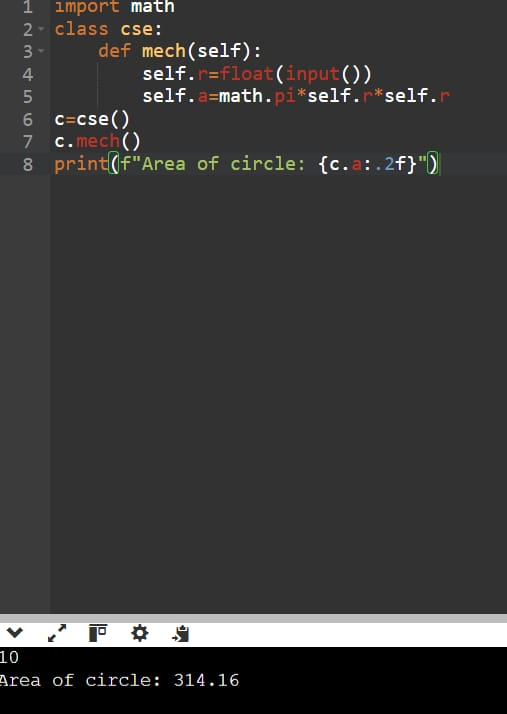
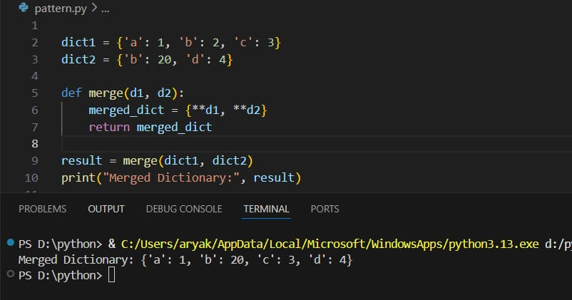
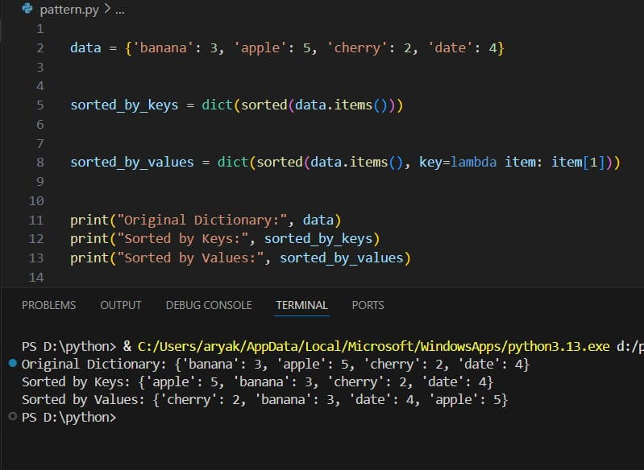
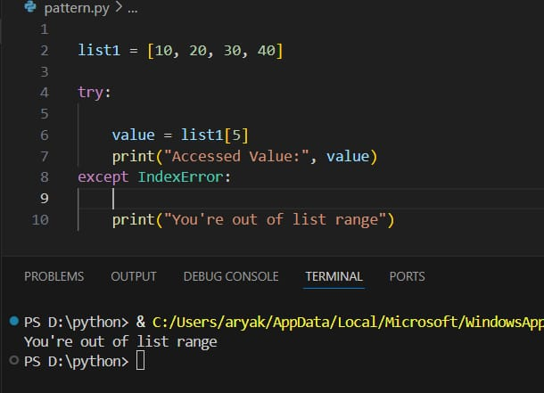
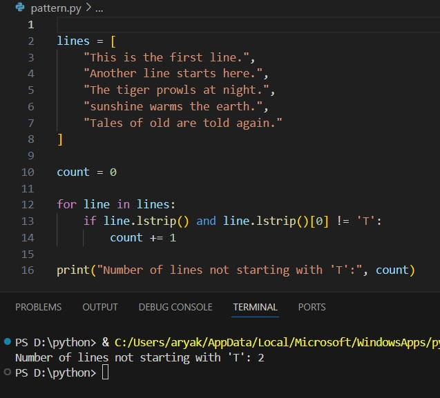

# Date:26/09/25
# Classes and Objects in Python: Calculate the Area of a Circle
# Aim
To write a Python program that calculates the area of a circle based on the radius provided by the user. This program uses a class named cse and a method mech to perform the calculation.

# Algorithm
Get user input: Take the radius of the circle as input from the user.
Define the class: Create a class named cse.
Define the method: Inside the class, define the method mech to calculate the area of the circle using the formula:
Area = pi *r^2
Execute the program: Create an object of the class and call the method with the radius value.
# Program
Add code here
```
1mport math
class cse:
def mech(self):
    self.=float(input())
    self. =math.pi*self.*self.r
c=cse()
c.mec()
print(f"Area of circle:fc.c:.2f7")
```

# Output

# Result
Successfully executed!
# Dictionary Operations in Python: Merging Two Dictionaries
# Aim
To write a Python program that merges two dictionaries and combines their key-value pairs.

# Algorithm
Define two dictionaries dict1 and dict2 with some key-value pairs.
Define a function merge() that merges the two dictionaries using the ** unpacking operator.
The merged result will combine keys from both dictionaries. If a key exists in both, the value from dict2 will overwrite that from dict1.
Call the merge() function and print the merged dictionary.
# Program
Add code here
```
dict1 = [f'a':1, 'b':2，'C':37]
dict2=['b'：20，'d':4]        
def merge(d1, d2):
    merged_dict = [**d1，**d2]
    return merged dict
result = merge(dict1, dict2)
print("Merged Dictionary:", result)
```
# Output

# Result
Successfully executed!
 # Dictionary-Python Program to Sort a Dictionary by Keys and Values
This Python program demonstrates how to sort a dictionary:

Alphabetically by keys
Alphabetically by values
# Aim
To write a Python program that sorts a dictionary's:

Keys in alphabetical order
Values in alphabetical order
# Algorithm
Start the program.
Define a dictionary with key-value pairs.
Sort by Keys:
Use sorted(dictionary.items())
Convert the result to a dictionary using dict()
Sort by Values:
Use sorted(dictionary.items(), key=lambda item: item[1])
Convert the result to a dictionary using dict()
Display the original and sorted dictionaries.
End the program.
# Program
Add Code here
```
data = [f'banana':3,'apple':5,'cherry':2,'date':4]
sorted_by_keys = dict(sorted(data.items()))
8sorted by_values = dict(sorted(data. items()，key=lambda item:item[1]))
print("original Dictionary:", data)
print("sorted by Keys:", sorted by keys)
print("Sorted by Values:", sorted_by_values)

```
# Sample Output

# Result
Successfully executed!
# Exception Handling in Python: Avoiding Index Errors
# Aim
To write a Python program that handles an IndexError when trying to access an element beyond the available range of a list.

# Algorithm
Define a list list1 with some integer elements.
Use a try-except block:
In the try block, attempt to access an index that is out of range (e.g., list1[5]).
In the except block, catch the error and print a custom message "You're out of list range".
Print the result based on whether the index access succeeds or fails.
# Program
Add code here
```
list1 =[10, 20，30， 40]
try:
value = list1[5]
print("Accessed value:", value)except IndexError:
print("You're out of list range")
```
# Output

# Result
Successfully executed!
# File Handling in Python: Count Lines Not Starting with 'T'
# Aim
To write a Python program that counts the number of lines in a text file story.txt that do not start with the alphabet 'T'.

# Algorithm
Open the file story.txt in read mode.
Initialize a counter count to zero.
Iterate through each line of the file:
Check if the first character of the line is not 'T'.
If the line does not start with 'T', increment the count by 1.
After processing all lines, print the count value, which represents the number of lines that do not start with 'T'.
# Program
Add code here
```
lines =["This is the first line.”,
"Another line starts here."
"The tiger prowls at night.","sunshine warms the earth.", "Tales of old are told again."]
count =0
for line in lines:
if line. Istrip() and line. Istrip()[0]!='T'：
    count += 1
print("Number of lines not starting with'T':”,count)`
```
# Output

# Result
Successfully executed!
